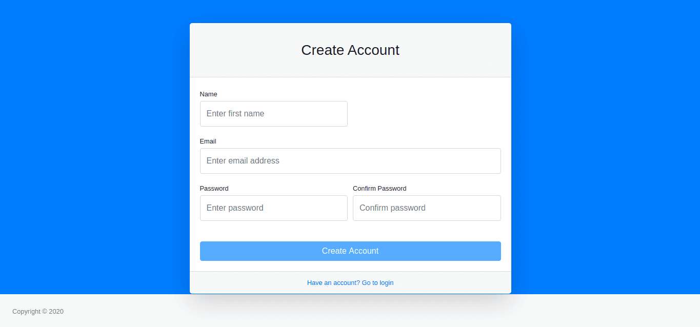
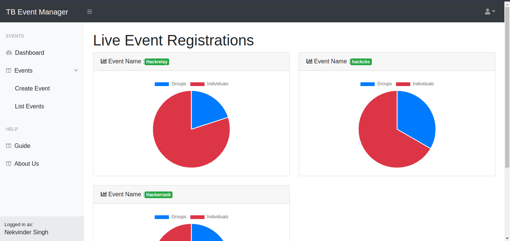
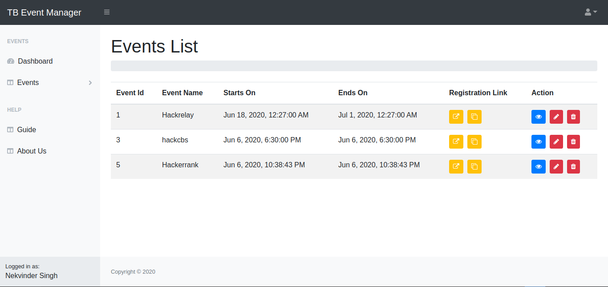
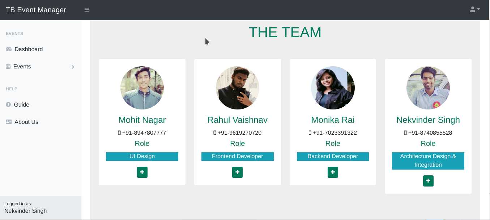
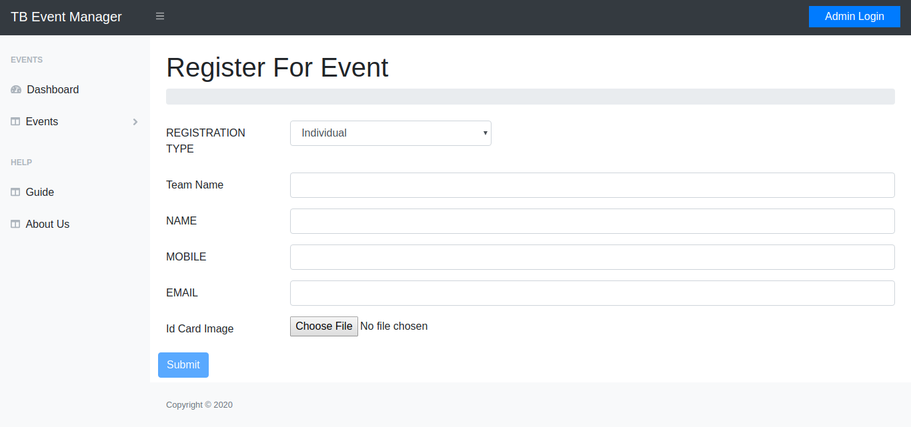
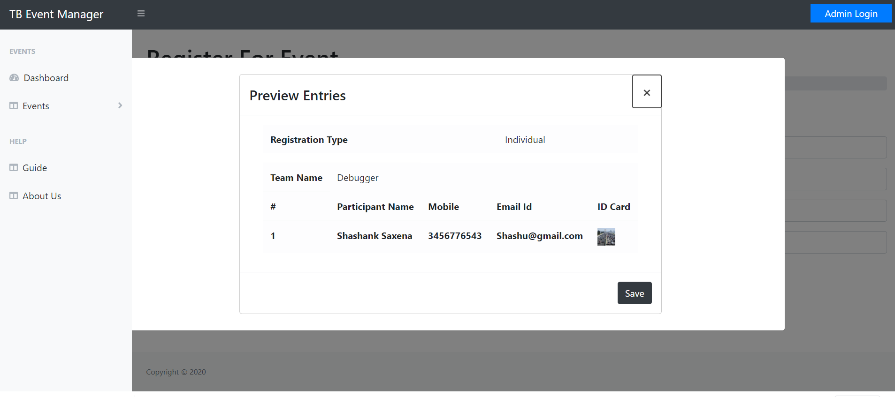
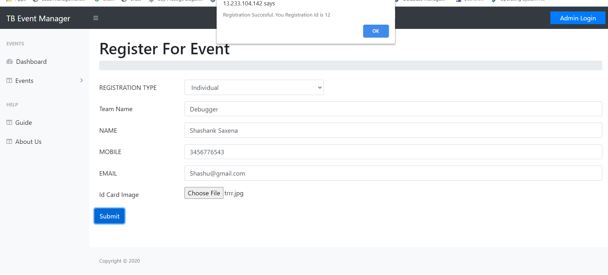

# Event Registration WebApp

A fullstack Webapp to manage participants registrations for multiple events.

## Index

Documentation Index
* [Concept](#concept) : Explains the basic design.
* [Functional Structure](#functional-structure) : Explains the features implemented in the app.
	* [Minimum Required](#core)
	* [Intermediate](#intermediate)
	* [AddOn Features](#addons)
* [Tech Stack](#tech-stack) : The technologies used for frontend and backend.
* [Configuration](#configuration) : Setup and run the code.
* [ScreenShots](#screenshots) : ScreenShots of the live app.
	* [Admin UI](#admin-ui)
	* [Participants UI](#participants-ui)

## Concept

- The webapp consideres **Admin** users to be the organisers of the events.
- Then different participants can register into those events, and their details would be managed and presented to the **Admin** users.
- Different admin users share the access, and can simultaneously manage participants details.

## Functional-Structure

### Features

#### Core

###### Frontend

- Data Capture - All mandatory fields(Full Name,Mobile,E-Mail,Upload ID Card).
- Provides a preview Screen which list all the fields above and ID card in the preview.
- On Submission Registration ID is generated and displayed.
- Stores all the information captured in a local database.
- Registration Date is system generated.

###### Backend

- Backend works as a separate service.
- REST Api is used for UI and Backend
- Backend use ORM(Object-relational mapping) to store data in DBMS, hence supports :
  _ SQlite (Currently Used)
  _ MySql \* MongoDB

#### Intermediate

- Charts on the basis of Registration types for separate events.
- Admin login functionality.
- Event creation and management by Administrators.
- List all Registrations in Admin view.
- View Registraion link for admin to view each registration details.

#### Addons

- Responsive Frontend UI.
- The architecture is scalable.

## Tech-Stack

> Frontend: Angular 9.1 + Bootstrap 4.0
> Backend: Python-3 (Django + Rest Framework)

#### Frontend
The frontend uses bootstrap designs to provide a cross-platform responsive layout, making the app accessible on mobile devices too.


#### Backend
The backend is designed in Python's Django framework and simply exposes REST Api endpoints which are configured into the frontend's environment parameter.

## Configuration

#### Requirements & SetUp

- **For Backend** : Python 3 + Django + Rest Framework
- **For Frontend** : Angular 9.1 + Nodejs
- **For Database** : sqlite

Goto directory : ```Backend/EventRegistrationBackend/```
Run:
> pip3 install -r req.txt


#### Frontend in angular 7
Goto directory : ```Frontend/```
Run:
> npm install
> ng serve

#### Backend in Python3 + Django + Django-rest-framework

To run

> python3 manage.py runserver

## ScreenShots

##### Admin-UI

- Admin Register
  

- Admin Login
  

- Dashboard
  

- Create Event
  

- Events list
  

- Participants list
  

- About
  

##### Participants-UI

- Dashboard
  

- Events list
  

- Event Registration form
  

- Registration Preivew
  

- Registration no. conformation
  